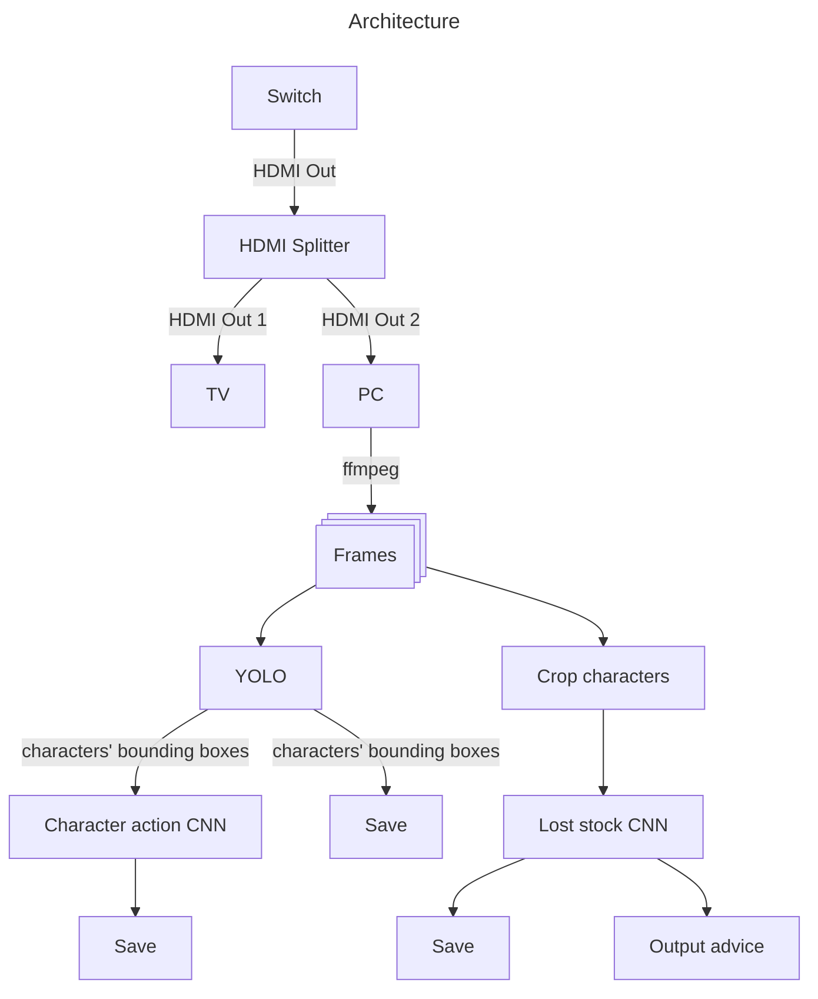

# Smashalytics

This project is intended to provide real-time analysis of your SSBU matches while they are being played. The scope of Smashalytics is to provide support on your competitive playstyle, therefore only those matches are supported.

